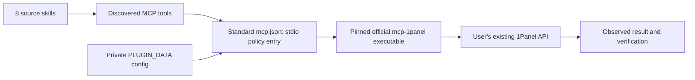

# 1Panel

Use the official 1Panel MCP through a bounded stdio entry, private configuration and executable access policy. English display name: **1Panel**. Package `1panel` 0.1.1 source repository: [1panel-plugin](https://github.com/full-stack-plugins/1panel-plugin). Release v0.1.1 is published through Full Stack Plugins; installed-client acceptance is separate; this is a community-maintained integration.

English | [简体中文](README.zh-CN.md) · [Architecture](docs/1Panel-Plugin-Architecture.md) · [Acceptance](docs/implementation-spec.md)

## Architecture and capabilities



Eight reusable skills cover routing, setup, system, websites, certificates, databases, apps and scoped security review. They are snapshotted from 1panel-skills with exact complete-skill content hashes. Official server source v1.0.0 / a12b2d4ddae90f6b210b73b89ba2bc4b572dcd0c is separately built/installed; no GPL server source or binary is bundled in this Apache package.

The default readonly policy exposes six read tools. readwrite adds create_website/create_ssl/create_database; full additionally exposes install_mysql/install_openresty. Discovery is filtered and direct disallowed/unknown calls are rejected. An access setting makes a tool callable; it does not grant blanket user authorization or panel-side RBAC. The pinned release lacks server access-level flags; the plugin enforces these levels itself.

No deletion, firewall, SSH, backup/restore, arbitrary SQL, generic app installation or certificate renewal/binding tools are promised. Lists cap at 500. Certificate creation picks the first ACME account internally; MySQL creation defaults source permission to `%`; generated passwords are not a reliable credential delivery channel. See the skills' local tools references before operations.

## Explicit setup

Requires Python 3.11+, an existing panel with API enabled and a trusted official executable. Root mcp.json is Agent Plugins 1.0.0, with no secrets or reliance on inherited PANEL variables. `${PLUGIN_DATA}` is supplied by a portable client; private configuration is never stored in the plugin.

For an explicit source build, use an existing official checkout containing tag v1.0.0, Git and Go 1.25+:

```text
python scripts/build_official.py --source <official-checkout> --output <new-absolute-binary-path>
```

The helper verifies the ref/commit, builds with GOTOOLCHAIN=local, writes a build receipt with SHA256, and never installs/upgrades Go. Building fetches project dependencies. Verify the source/receipt before using its hash; a hash alone is not publisher authentication.

```text
python scripts/setup_connection.py --data <absolute-client-data> --binary <verified-absolute-binary> --binary-sha256 <verified-sha256> --host <https-panel-origin>
```

The key is entered through a hidden prompt. connection.json stores binary identity, host, reviewed commit and access level; credentials.json is protected separately (POSIX mode / Windows current-user ACL). Do not paste keys into chat. Settings default readonly; `--access-level readwrite` or full is an explicit change, and `--replace` is required to overwrite existing settings. Reconnect afterward. The child receives credentials in its environment, not process arguments. Its local logs are confined to the private runtime directory; no payloads are logged by the plugin.

Native Codex/Claude metadata and .mcp.json are compatibility files. Native clients that do not supply/expand PLUGIN_DATA must set an absolute private data path in their native configuration. Use an actual Python executable when a client cannot launch a Windows .cmd alias. Runtime interpolation and installed-client loading remain separately unverified; do not treat manifest parity as installation proof.

## Operation and failure contract

Resolve exact target and authorization, inspect existing resources, submit one bounded operation, then verify with available reads. Requests are not automatically retried. Timeout or child loss reports unknown outcome: inspect actual panel state before resubmission. No automatic deletion rollback. Invalid setup fails with a concise nonsecret diagnostic; skill loading can continue even when the MCP entry is unavailable.

## Validate and package

```bash
python scripts/validate_portable_plugin.py
python scripts/validate_markdown_links.py
python scripts/check_snapshot.py
python -m unittest discover -s tests -v
python scripts/package_plugin.py
```

For real official-MCP integration tests, set ONEPANEL_TEST_BINARY to the pinned externally built executable before the unittest command. Without it, integration tests are explicitly skipped, not reported as covered. The suite initializes the real official server via this shipped proxy and calls all 11 tools against a loopback simulated API, checking authentication, policy, errors, redaction and unknown outcomes. No production server is changed.

The archive/SHA256 go to dist/ and exclude keys, logs and local binaries. See [verification](docs/verification.md). Hosted release, marketplace registration and user-installed-client/production-panel acceptance remain separate. [License](LICENSE) and [source notices](THIRD-PARTY-NOTICES.md).

## Installation and skill ownership

Add `partme-ai/full-stack-plugins` using your client marketplace interface, then select **1Panel**. The install source is pinned to `v0.1.1`. Configure the official executable, private data directory and panel API first; installing the skills does not configure the connection.

Skills are maintained only in `1panel-skills`. After publishing a source version, update the pinned release and run:

```bash
python scripts/vendor/skill_vendor.py update
python scripts/vendor/skill_vendor.py check
python scripts/check_snapshot.py
```
