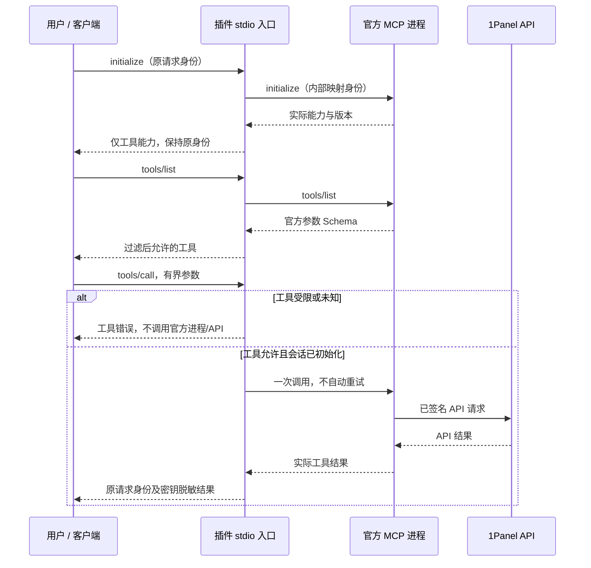

# 1Panel Plugin 架构

版本 0.1.0，本地实现。插件入口集成官方 mcp-1panel v1.0.0，不重新实现面板 API，也不代表官方插件。

## 职责与信任边界

| 组件 | 所有者 / 实现 |
|---|---|
| 操作分流与领域限制 | 1panel-skills 的 8 个原创技能 |
| 标准发现 | 根 plugin.json 和标准 mcp.json |
| 私有连接设置 | scripts/setup_connection.py，仅由用户显式运行 |
| stdio 权限与消息处理 | scripts/panel_proxy.py，Python 标准库 |
| API 参数、认证和请求 | 独立构建的官方锁定版 mcp-1panel |
| 真实目标与操作授权 | 用户选定面板及明确的有界任务 |

## 配置与生命周期

仅由明确的私有数据目录确定配置。connection.json 保存二进制路径/SHA256、面板地址、access_level 和已检查 upstream_commit；credentials.json 保存私有 API 密钥。不通过继承的 PANEL 变量选择目标。标准 mcp.json 使用 `${PLUGIN_DATA}`；原生宿主未支持该变量时须明确配置私有路径。

启动时校验锁定二进制 SHA256，凭据通过环境传给子进程，不放进参数；日志位于私有 runtime 工作目录。这是依据用户已验证设置进行完整性检查，不是发布者签名认证或系统沙箱。构建工具固定真实发布 commit，使用已有编译器，不隐式升级 Go 或覆盖二进制。

每个连接启动一个官方 stdio 进程，将客户端请求 ID 映射为内部 ID。消息上限 1 MiB，同时请求上限 32，期限 60 秒。支持 initialize、initialized、ping、tools/list、tools/call 和取消通知。不声明或支持官方进程主动要求 sampling、elicitation 或 roots。EOF/退出时终止子进程，待处理工具结果可能未知；不创建持久批准账本。

## 权限、重试与回滚

默认 readonly（6 个读取工具），readwrite 增加 3 个创建，full 增加 2 个安装。即便上游新增工具，未知名称仍被拒绝。工具发现过滤和直接调用检查均有独立执行测试。技能仍负责用户授权和准确目标，工具可用不是全面同意、认证或面板 RBAC。

不自动提交重试。超时、取消或子进程丢失不能证明写入没有发生；标为未知，读取或人工检查实际资源，再决定下一步。不虚构自动删除回滚。配置缺失或无效时输出脱敏启动诊断，仅影响该 MCP 连接，技能说明仍可使用。

## 评估与部署验证边界

测试通过插件入口运行真实锁定版官方二进制，对回环模拟 API 调用全部 11 个工具，覆盖三档工具发现、直接绕过尝试、面板哈希认证、实际 API 路由、密钥反射脱敏、输入失败和超时未知结果。模拟 API 不证明生产面板、真实 ACME 签发、应用安装或已安装客户端行为。

包检查还覆盖标准结构、来源哈希、链接和复制运行。技能源发布及用户安装验收属于独立状态。实际本地结果见 verification.md，可复现命令见 README.zh-CN.md。
